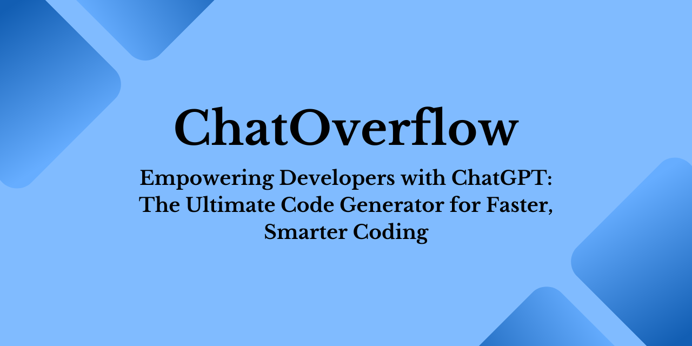

  

  

# ChatOverflow

ChatOverflow is a powerful tool that empowers developers to generate high-quality, customized code with ease. Using the advanced natural language processing capabilities of the OpenAI ChatGPT model, ChatOverflow is able to analyze user input and generate code that meets specific programming requirements.

# Features

__Easy-to-use:__ ChatOverflow is designed to be simple and intuitive, even for those without extensive coding experience. Users can input programming requirements in natural language, and ChatOverflow will do the rest.

__Customizable:__ ChatOverflow can be tailored to specific programming languages and environments, allowing developers to generate code that meets their exact needs.

__Efficient:__ With the ChatGPT model's advanced natural language processing capabilities, ChatOverflow is able to generate high-quality code quickly and accurately, saving developers time and effort.

## Getting Started

To use the ChatGPT Code Generator follow the steps below:

1. Clone this GitHub repo using the following command

`git clone https://github.com/rajtilakjee/chatoverflow.git`

2. Install all the modules/libraries given in the `requirements.txt` file

`pip install -r requirements. txt`

3. Run the program

`python chatoverflow.py`

# Share with the community

Please consider sharing a post about [ChatOverflow](https://github.com/rajtilakjee/chatoverflow) and the value it provides. It really does help!

## Contribution

There are many ways to contribute to the DevMaps OpenSource project:

 - Give a GitHub star to the project
 - Create GitHub issues and help us to find bugs and/or request features
 - Contribute to the source code

Please check our [CONTRIBUTING](CONTRIBUTING.md) guidelines.

# Contributors

# Credits

 - Thanks to Open AI

# License

MIT license with exceptions. See the [full license](LICENSE) for details.

Copyright (c) 2023-present, Rajtilak Bhattacharjee

Permission is hereby granted, free of charge, to any person obtaining a copy
of this software and associated documentation files (the "Software"), to deal
in the Software without restriction, including without limitation the rights
to use, copy, modify, merge, publish, distribute, sublicense, and/or sell
copies of the Software, and to permit persons to whom the Software is
furnished to do so, subject to the following conditions:

The above copyright notice and this permission notice shall be included in all
copies or substantial portions of the Software.

THE SOFTWARE IS PROVIDED "AS IS", WITHOUT WARRANTY OF ANY KIND, EXPRESS OR
IMPLIED, INCLUDING BUT NOT LIMITED TO THE WARRANTIES OF MERCHANTABILITY,
FITNESS FOR A PARTICULAR PURPOSE AND NONINFRINGEMENT. IN NO EVENT SHALL THE
AUTHORS OR COPYRIGHT HOLDERS BE LIABLE FOR ANY CLAIM, DAMAGES OR OTHER
LIABILITY, WHETHER IN AN ACTION OF CONTRACT, TORT OR OTHERWISE, ARISING FROM,
OUT OF OR IN CONNECTION WITH THE SOFTWARE OR THE USE OR OTHER DEALINGS IN THE
SOFTWARE.
